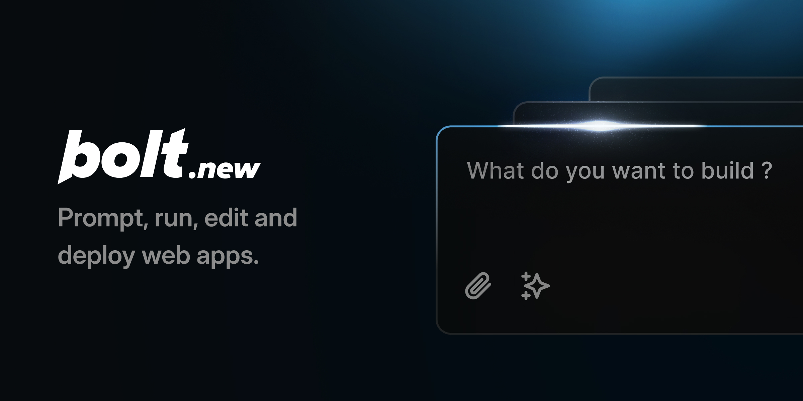

# https://www.bolt.new
analog bolt.new

# Bolt.new: AI-Powered Full-Stack Web Development in the Browser

Bolt.new is an AI-powered web development agent that allows you to prompt, run, edit, and deploy full-stack applications directly from your browser—no local setup required. If you're here to build your own AI-powered web dev agent using the Bolt open source codebase, [click here to get started!](./CONTRIBUTING.md)
Перейти к основному содержимому
Главная страница Boltсветовой логотиптемный логотип Центр поддержки Центр поддержки

Поиск...
Ctrl K
Начните работу с Bolt
Введение в Bolt
Краткое руководство пользователя
Видеоуроки
Работа в Bolt
Агенты и модели
Резервное копирование и восстановление
Использование окна чата
Использование CodeView
Управление проектами
Персональные настройки
Настройки проекта
Поддерживаемые технологии
Болтовое облако
Что такое Bolt Cloud?

База данных
Обзор
Расширенные настройки
Аутентификация
Хранилище файлов
Журналы
Секреты
Безопасность
Функции сервера
Таблицы
Управление пользователями
Часто задаваемые вопросы

Домены

Хостинг
Передовые методы
Спланируйте свое приложение
Режимы планирования и обсуждения
Максимально повысить эффективность токенов
Оперативно и эффективно
Использование болта с другими инструментами
Выставка мобильных приложений
Figma для дизайна
GitHub для контроля версий
Google SSO для аутентификации
Импорт из Любимого
Netlify для хостинга
Stripe для платежей
Supabase для баз данных
Учетные записи и подписки
Счета
Выставление счетов
Корпоративное и коммерческое
Токены
Реферальная программа
Команды
Обзор
Планы и выставление счетов
Управление командами
Управление проектом
Поиск неисправностей
Проблемы со входом в систему
Проблемы интеграции
Проблемы с болтами
Дополнительная помощь
Связаться со службой поддержки
Понятия и контекст
Введение в базы данных
Введение в программу магистратуры в области права (LLM).
История версий, система контроля версий и GitHub
Главная страница Boltсветовой логотиптемный логотип

Поиск...
Ctrl K
Примечания к выпуску
Статус болта

Поиск...

Навигация
База данных
База данных
Примечания к выпуску
Статус болта

На этой странице
Настройки базы данных
Преимущества базы данных Bolt
Создание и использование баз данных с помощью Claude Agent
Попросите Bolt не создавать базу данных.
Восстановление истории версий и базы данных.
Базы данных, автоматически приостановленные
Проекты с базами данных Supabase, опубликованные до 30 сентября 2025 года.
Просмотреть ограничения базы данных болтов
Как Bolt предоставляет ресурсы для работы с базой данных
База данных
База данных
Создавайте и управляйте базами данных в Bolt без необходимости использования сторонних инструментов.

Bolt упрощает добавление функциональности базы данных в ваше приложение без необходимости создания дополнительной инфраструктуры. Вы получаете готовую к использованию базу данных, когда она требуется вашему проекту, что позволяет вам сосредоточиться на разработке функций, а не на настройке серверов.
​
Настройки базы данных
Скриншот пунктов меню настроек базы данных в Bolt.
В настройках проекта Bolt есть несколько разделов, позволяющих управлять данными проекта и связанными с ним функциями. Некоторые из них находятся в левом меню настроек проекта, а другие — в верхней части экрана базы данных (таблиц) . Щелкните любой пункт ниже, чтобы узнать больше об этой теме.
Расширенные настройки
Аутентификация
Хранилище файлов
Журналы
Секреты
Аудит безопасности
Функции сервера
Таблицы
Управление пользователями
Часто задаваемые вопросы
​
Преимущества базы данных Bolt
Использование базы данных Bolt помогает быстро запускать более сложные веб-приложения:
Неограниченное количество баз данных: создавайте столько баз данных, сколько необходимо.
Никакой ручной настройки: забудьте о настройке серверов или хостинга, Bolt сделает это за вас.
Встроенная система управления аутентификацией: легко добавьте в свой проект возможности регистрации пользователей.
Один центр мониторинга: отслеживайте безопасность и журналы событий, не переключаясь между инструментами.
Перспективные подключения: Легко подключайте внешние инструменты в будущем для расширенного управления.
Эта конфигурация идеально подходит для быстрой разработки, тестирования и масштабирования вашего приложения.
If you’re new to the concept of databases and their importance in web development, you can learn more in our Introduction to databases article.
​
Creating and Using Databases with Claude Agent
When working with Claude Agent, new Bolt databases are created automatically based on your project’s needs or when you explicitly ask the agent to create a database or a database-related feature. This makes it easy to get started without manually setting anything up. If you are using v1 Agent (legacy), you can inherit a Bolt database that was created with Claude Agent, but you cannot create new databases while working in v1 Agent. For new projects, Bolt strongly recommends using Claude Agent to create and manage Bolt databases for you. This approach ensures your projects stay up to date with the latest features and are easier to maintain.
See Agents to learn more about the differences between agents and how to switch.
​
Ask Bolt not to create a database
If you don’t want Bolt to provision a database, you can explicitly request that it not do so. For example, when submitting a prompt, add the instruction: Don't use a database, I want to use local storage for this app.
​
Version history and database restores
Bolt’s Version History feature currently does not support database restores.
Restoring to an earlier project version will not change your current databases.
​
Automatically paused databases
If your project’s Bolt database hasn’t been used for six days or more, it may be automatically paused to conserve resources. When you next open your project, you’ll see a message letting you know that the database is being restored. This process usually only takes a few minutes. This is a normal, routine operation. Please wait for the restoration to finish before making any changes to your project to avoid potential issues.
​
Projects with Supabase databases published prior to September 30, 2025
Before September 30, 2025, Bolt projects required you to use your own Supabase account for databases. After this date, new projects created with Claude Agent use Bolt databases by default. Bolt does not support switching existing projects from Supabase to Bolt Database.
If you have an existing project using Supabase databases:
Keep using Supabase for your databases.
Supabase databases cannot be converted into Bolt databases.
You can switch from v1 Agent (legacy) to Claude Agent at any time. Your Supabase databases will still work. The only change you may notice is that your chat history window will reset when you switch.
If you are starting a new project:
Claude Agent will create and use Bolt databases by default.
You can migrate a Bolt database to Supabase later if you want.
Projects created with v1 Agent (legacy) only support Supabase databases. These must be added after the initial build. The v1 Agent (legacy) cannot create Bolt databases.
Подробнее о переключении между агентом Клода и агентом версии 1 (устаревшей) в Bolt см . в разделе «Агенты» .
​
Просмотреть ограничения базы данных болтов
Ограничения, связанные с базой данных, можно посмотреть в разделе «Облако» в личных настройках. Bolt Cloud 1 Pn Чтобы просмотреть лимиты, выполните следующие действия:
Нажмите на значок своего профиля в правом верхнем углу экрана, затем нажмите «Настройки» .
Нажмите «Облако».
Просмотрите строки таблицы, относящиеся к базе данных.
​
Как Bolt предоставляет ресурсы для работы с базой данных
При создании проекта Bolt может автоматически создать базу данных, если ваше приложение этого требует или если вы явно запросите её. Например, если вы создаёте приложение-викторину, Bolt настроит базу данных для хранения вопросов и ответов. Такие функции, как аутентификация пользователей, могут не добавляться автоматически, но вы можете указать Bolt включить регистрацию и вход в систему, если это необходимо вашему приложению. Например:Create user accounts via email signup and login, then add account sign in/log out buttons in the top right corner of the home page.
Была ли эта страница полезной?

ДаНет
Что такое Bolt Cloud? Расширенные настройки
Главная страница Boltсветовой логотиптемный логотип
x github discord linkedin youtube reddit instagram
Условия использования Политика конфиденциальности
x github discord linkedin youtube reddit instagram
Помощник

Ответы генерируются с помощью искусственного интеллекта и могут содержать ошибки.
Задайте вопрос...
